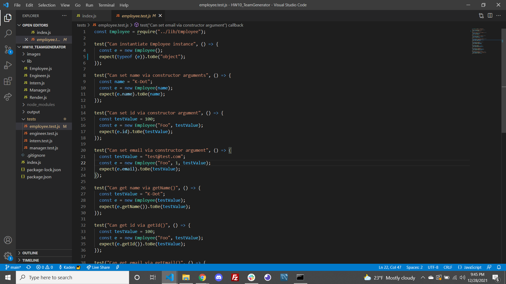
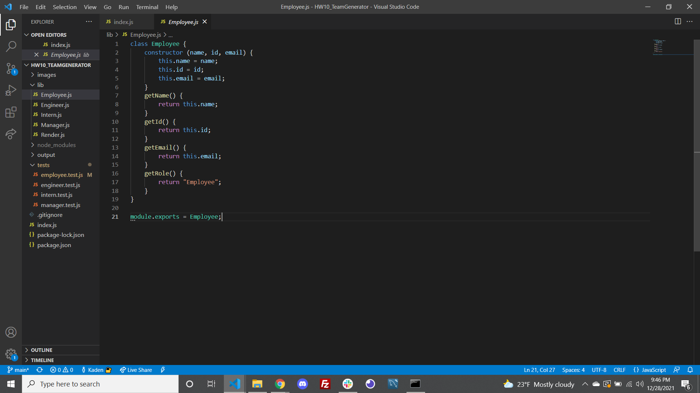
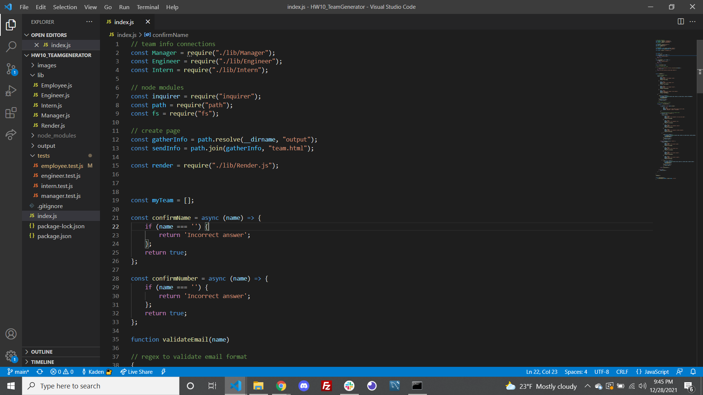

# # Kaden
(https://opensource.org/licenses/MIT)
## INSTRUCTIONS
This project is designed to take in user input to create a dynamic team consisting of at least one manager and an assortment of engineers and interns if so desired. 

##Table of Contents
*[Installation:] (#installation)
*[Usage:] (#usage)
*[License:](license)
*[Contribution:] (#contributing)
*[Testing:] (#tests)
*[Questions?](#questions)

##Installation
To install this generator so that it functions properly, open the integrated terminal tied to the current project folder, then run 'npm install' in your terminal. This should download all necessary packages.

##Usage
You can use this program to build either hypothetical or realistic task force teams. This is our introduction to object oriented programing so the main benefit to this app is to practice manipulating objects on the backend and creating new ones as well to be used on the front end.

##Example
Here you can see some key elements within the code, that ensures that these objects are possible to create, that the path is being directed to the right location and how the employee constructors were built:

 # License
            This project is license under the MIT license
            

##Contributing
Users can contribute to this project by adding features to the template literal that will provide a more elaborate and eye appealing webpage. Such as colors, background images, interactive animations etc.

##Tests
This project can be tested by visiting my GitHub repositories, clone the HW10_TeamGenerator repository, follow the installation instructions and then test the project yourself! After running the installation, start the application in the command-line by typing in "npm start"

##Questions

    If you have any questions regarding the repository published, please feel free to reach out to me at kadenkelsey33@gmail.com,
    if you would like to look at the code that made this application, you can find this under my repos in GitHub. My GitHub
    username is K-Kelsey
    
